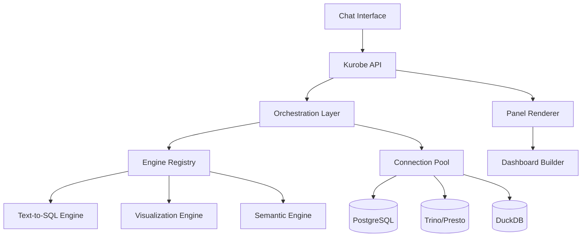

# Kurobe - Production-Ready BI Chat Platform


Kurobe is a configuration-driven, engine-agnostic Business Intelligence chat platform that transforms natural language questions into interactive dashboard panels. Built with enterprise-grade architecture, it supports multiple data sources and pluggable AI engines.

## 🌟 Key Features

### 💬 Question-Driven Dashboards
- Each chat session represents one "question" that materializes into dashboard panels
- Natural language to SQL generation with multiple engine support
- Smart visualization recommendations based on query results
- Pin panels to create persistent dashboards

### 🔧 Configuration-Driven Architecture
- Swap Text-to-SQL, visualization, and semantic engines via YAML configuration
- No code changes required to switch between AI providers
- Support for Anthropic, OpenAI, and local models
- Extensible engine interface for custom implementations

### 🗄️ Multi-Database Support
- Native connectors for PostgreSQL, Trino/Presto, and DuckDB
- Connection pooling with health monitoring
- Query caching and result optimization
- Secure credential storage with encryption

### 📊 Enterprise Features
- Row-level security for multi-tenant isolation
- Comprehensive audit logging for compliance
- API key authentication with rate limiting
- Real-time query execution monitoring

## 🏗️ Architecture



## 🚀 Quick Start

### Prerequisites
- Python 3.11+
- Node.js 20+
- PostgreSQL 15+
- Redis 6+
- Docker & Docker Compose (optional)

### Installation

1. **Clone the repository**
```bash
git clone https://github.com/your-org/kurobe.git
cd kurobe
```

2. **Quick Start with Script**
```bash
# Copy and configure environment
cp config.sample.env backend/.env
# Edit backend/.env with your API keys and configuration

# Start everything (infrastructure + backend)
python start.py

# Or just use make
make dev
```

3. **Manual Setup**

**Set up the SDK:**
```bash
cd sdk && pip install -e . && cd ..
```

**Configure the backend:**
```bash
cd backend
cp ../config.sample.env .env
# Edit .env with your configuration

# Install dependencies
pip install -e .

# Start infrastructure
make docker-up

# Run database migrations
make migrate

# Start the API server
uvicorn app.main:app --reload
```

4. **Set up the frontend** (optional)
```bash
cd frontend
npm install

# Create environment file
echo "NEXT_PUBLIC_API_URL=http://localhost:8000/api/v1" > .env.local

# Start the development server
npm run dev
```

5. **Configure engines**
Edit `config/engines.yaml` to set up your AI providers:
```yaml
text_to_sql:
  default:
    provider: "anthropic"
    config:
      model: "claude-3-opus-20240229"
      api_key: ${ANTHROPIC_API_KEY}
```

## 📚 SDK Usage

### Basic Example
```python
from kurobe import KurobeClient

# Initialize client
client = KurobeClient(api_key="your-api-key")

# Create a question
question = await client.Question.create(
    text="Show me monthly sales trends for 2024",
    connection_ids=["postgres-prod"]
)

# Get generated panels
panels = await question.get_panels()

# Continue the conversation
response = await question.chat("Break it down by product category")
```

### Creating Custom Engines
```python
from kurobe.core.interfaces import TextToSQLEngine, EngineConfig

class CustomTextToSQLEngine(TextToSQLEngine):
    async def generate_sql(self, question: str, **kwargs):
        # Your implementation here
        return {
            "sql": generated_sql,
            "connection_id": connection_id,
            "confidence": 0.95
        }
```

## 🔧 Configuration

### Engine Configuration
Engines are configured in `config/engines.yaml`:
- **Text-to-SQL**: Converts natural language to SQL queries
- **Visualization**: Recommends appropriate chart types
- **Semantic**: Analyzes intent and plans execution

### Database Connections
Configure connections via API or configuration:
```python
await client.Connection.create(
    name="analytics-db",
    type="postgres",
    config={
        "host": "localhost",
        "port": 5432,
        "database": "analytics"
    }
)
```

## 📊 Panel Types

Kurobe supports various visualization types:
- **Line Charts**: Time series data
- **Bar Charts**: Categorical comparisons
- **Pie Charts**: Distribution analysis
- **Tables**: Detailed data views
- **Metrics**: Single KPI values
- **Heatmaps**: Correlation matrices
- And more...

## 🛡️ Security

- **API Key Authentication**: Secure key generation and validation
- **Row Level Security**: PostgreSQL RLS for data isolation
- **Encrypted Credentials**: Safe storage of database passwords
- **SQL Injection Prevention**: Parameterized queries throughout
- **Audit Logging**: Complete activity tracking

## 🤝 Contributing

We welcome contributions! Please see [CONTRIBUTING.md](CONTRIBUTING.md) for guidelines.

### Development Setup
```bash
# Install development dependencies
cd backend && pip install -e ".[dev]"
cd ../frontend && npm install

# Run tests
cd backend && pytest
cd ../frontend && npm test

# Format code
cd backend && black . && ruff check --fix
cd ../frontend && npm run lint:fix
```

## 📄 License

Kurobe is licensed under the Apache License 2.0. See [LICENSE](LICENSE) for details.

## 🙏 Acknowledgments

This project builds upon patterns from the Kortix/Suna project, adapted for BI-specific use cases with a focus on configuration-driven architecture and enterprise readiness.

## 📞 Support

- Documentation: [docs.kurobe.ai](https://docs.kurobe.ai)
- Issues: [GitHub Issues](https://github.com/your-org/kurobe/issues)
- Discussions: [GitHub Discussions](https://github.com/your-org/kurobe/discussions)

---

Built with ❤️ for the data community
