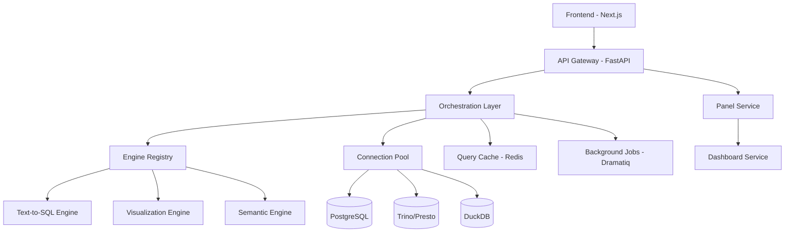

# System Patterns & Architecture

## High-Level Architecture



## Core Design Patterns

### 1. Configuration-Driven Engine System

**Pattern**: Registry + Factory + Strategy
```python
# Engine Registry manages pluggable engines
engine_registry = EngineRegistry()

# Engines are loaded from YAML configuration
await engine_registry.register_from_config("config/engines.yaml")

# Runtime engine selection based on configuration
text_to_sql_engine = await engine_registry.get_engine("text_to_sql", "default")
```

**Key Components**:
- `EngineRegistry`: Central registration and discovery
- `Engine` interfaces: Common contracts for all engine types
- `EngineConfig`: YAML-driven configuration with hot-reload
- Engine implementations: Anthropic, OpenAI, local models, rule-based

### 2. Question-to-Panel Pipeline

**Pattern**: Chain of Responsibility + Command
```python
# Pipeline: Question → Plan → Queries → Results → Panels
async def process_question(question: Question) -> List[Panel]:
    # 1. Semantic analysis
    plan = await semantic_engine.analyze(question.text)
    
    # 2. Query generation
    queries = await text_to_sql_engine.generate_queries(plan)
    
    # 3. Query execution
    results = await connection_pool.execute_queries(queries)
    
    # 4. Visualization recommendation
    panel_specs = await viz_engine.recommend_panels(results)
    
    # 5. Panel creation
    return await panel_service.create_panels(panel_specs)
```

### 3. Multi-Database Connection Management

**Pattern**: Pool + Proxy + Health Check
```python
class ConnectionPool:
    async def get_connection(self, connection_id: str):
        # Health check + connection reuse
        
    async def execute_query(self, connection_id: str, query: str):
        # Route to appropriate database type (Postgres/Trino/DuckDB)
        
    async def health_check(self, connection_id: str):
        # Periodic health monitoring
```

### 4. Panel Specification System

**Pattern**: Specification + Builder
```python
@dataclass
class PanelSpec:
    id: str
    type: ChartType
    title: str
    data: List[DataPoint]
    config: Dict[str, Any]
    
    # Builder methods for different chart types
    @classmethod
    def line_chart(cls, data, x_axis, y_axis):
        # Smart defaults for line charts
        
    @classmethod
    def metric(cls, value, title, format=None):
        # Single metric display
```

## Data Flow Patterns

### 1. Request-Response Flow
```
User Question → FastAPI → Orchestration Layer → Engines → Database → Results → Panels → Frontend
```

### 2. Background Processing
```
Heavy Queries → Dramatiq Queue → Background Worker → Cache Results → WebSocket Notification
```

### 3. Caching Strategy
```
Query Hash → Redis Check → Database (if miss) → Cache Store → Return Results
```

## Security Architecture

### 1. Authentication Pattern
```python
# API Key based authentication
@app.middleware("http")
async def api_key_middleware(request: Request, call_next):
    api_key = extract_api_key(request)
    user = await validate_api_key(api_key)
    request.state.user = user
    return await call_next(request)
```

### 2. Row-Level Security (RLS)
```sql
-- PostgreSQL RLS policies ensure data isolation
CREATE POLICY questions_owner_policy ON questions
    FOR ALL USING (user_id = current_setting('app.current_user_id')::UUID);
```

### 3. Credential Encryption
```python
# Database credentials encrypted at rest
from cryptography.fernet import Fernet

encrypted_config = fernet.encrypt(json.dumps(connection_config).encode())
```

## Error Handling Patterns

### 1. Structured Error Response
```python
class KurobeException(Exception):
    def __init__(self, message: str, error_code: str, details: Dict = None):
        self.message = message
        self.error_code = error_code
        self.details = details or {}

@app.exception_handler(KurobeException)
async def kurobe_exception_handler(request, exc):
    return JSONResponse(
        status_code=400,
        content={
            "error": exc.error_code,
            "message": exc.message,
            "details": exc.details
        }
    )
```

### 2. Circuit Breaker for External Services
```python
from tenacity import retry, stop_after_attempt, wait_exponential

@retry(stop=stop_after_attempt(3), wait=wait_exponential(multiplier=1, min=4, max=10))
async def call_llm_api(prompt: str):
    # Auto-retry with exponential backoff
```

## Observability Patterns

### 1. Structured Logging
```python
import structlog

logger = structlog.get_logger()

async def process_question(question_id: UUID, user_id: UUID):
    logger.info("Question processing started", 
                question_id=question_id, 
                user_id=user_id)
    
    # Processing logic...
    
    logger.info("Question processing completed",
                question_id=question_id,
                panels_created=len(panels))
```

### 2. LLM Tracing with Langfuse
```python
from langfuse import Langfuse

langfuse = Langfuse()

@langfuse.observe()
async def generate_sql(question: str) -> str:
    # Automatic LLM call tracing
```

### 3. Metrics Collection
```python
from prometheus_client import Counter, Histogram

QUESTIONS_PROCESSED = Counter('questions_processed_total')
QUERY_DURATION = Histogram('query_duration_seconds')

@QUERY_DURATION.time()
async def execute_query(query: str):
    # Automatic timing metrics
```

## Database Design Patterns

### 1. Event Sourcing for Audit
```sql
-- All changes tracked in audit_log
CREATE TABLE audit_log (
    id UUID PRIMARY KEY DEFAULT uuid_generate_v4(),
    user_id UUID REFERENCES users(id),
    action VARCHAR(100) NOT NULL,
    resource_type VARCHAR(50) NOT NULL,
    resource_id UUID,
    details JSONB DEFAULT '{}'
);
```

### 2. Soft Deletes with Timestamps
```sql
-- Standard pattern across all tables
CREATE TABLE questions (
    id UUID PRIMARY KEY DEFAULT uuid_generate_v4(),
    -- fields...
    created_at TIMESTAMPTZ DEFAULT NOW(),
    updated_at TIMESTAMPTZ DEFAULT NOW(),
    deleted_at TIMESTAMPTZ NULL
);
```

### 3. JSONB for Flexible Configuration
```sql
-- Engine configs stored as JSONB for flexibility
CREATE TABLE engine_configs (
    id UUID PRIMARY KEY,
    config JSONB NOT NULL, -- Flexible configuration
    -- constraints...
);
```

## Frontend Architecture Patterns

### 1. Server State Management with React Query
```typescript
// API state management
const { data: questions } = useQuery({
    queryKey: ['questions', userId],
    queryFn: () => questionsApi.getQuestions(userId)
});
```

### 2. Component Composition
```typescript
// Panel components composed by type
function PanelRenderer({ spec }: { spec: PanelSpec }) {
    switch (spec.type) {
        case 'line': return <LineChart spec={spec} />;
        case 'bar': return <BarChart spec={spec} />;
        case 'table': return <DataTable spec={spec} />;
        default: return <ErrorPanel />;
    }
}
```

### 3. Type-Safe API Layer
```typescript
// Generated types from backend schemas
interface Question {
    id: string;
    text: string;
    panels: Panel[];
    status: 'pending' | 'processing' | 'completed' | 'failed';
}
```

## SDK Architecture

### 1. Client-Server Communication
```python
# High-level SDK interface
client = KurobeClient(api_key="kb_xxx")

question = await client.Question.create(
    text="Show me sales trends",
    connection_ids=["postgres-prod"]
)

panels = await question.get_panels()
```

### 2. Resource-Based API Design
```python
# RESTful resource organization
client.Question.create()
client.Question.get(id)
client.Panel.pin(id)
client.Dashboard.create()
client.Connection.test(id)
```

This architecture prioritizes flexibility through configuration, type safety through comprehensive schemas, and observability through structured logging and metrics. The patterns enable hot-swapping of engines, secure multi-tenant data access, and scalable query processing.
