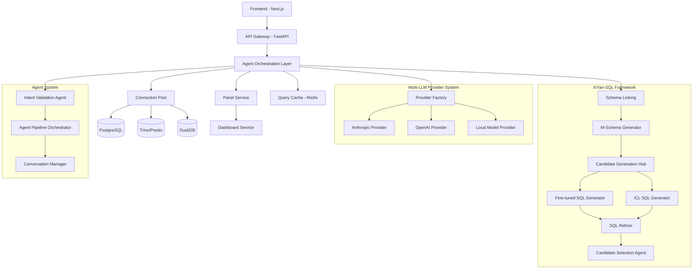

# System Patterns & Architecture

## High-Level Architecture - Agents-to-Agents System



## Core Design Patterns

### 1. Multi-LLM Provider System

**Pattern**: Abstract Factory + Strategy + Dependency Injection
```python
# Provider Factory creates configured LLM providers
provider_factory = LLMProviderFactory(config)

# Runtime provider selection based on configuration
anthropic_provider = await provider_factory.create_provider("anthropic")
openai_provider = await provider_factory.create_provider("openai")

# Agents use dependency injection for providers
intent_agent = IntentValidationAgent(anthropic_provider, config)
sql_agent = FineTunedSQLGenerator(openai_provider, config)
```

**Key Components**:
- `ILLMProvider`: Abstract interface for all providers
- `LLMProviderFactory`: Creates and manages provider instances
- `ProviderConfig`: Configuration injection with validation
- Provider implementations: Anthropic, OpenAI, Local models with unified interface

### 2. XiYan-SQL Framework Pipeline

**Pattern**: Multi-Agent Collaboration + Candidate Generation
```python
# Pipeline: Intent Validation → Schema Linking → Candidate Generation → Selection → Panels
async def process_question_with_agents(question: str, context: AgentContext) -> List[Panel]:
    # 1. Intent validation and refinement
    intent_result = await intent_agent.process(question, context)
    if not intent_result.success:
        return await handle_refinement_dialog(intent_result)
    
    # 2. Schema linking and M-Schema generation
    m_schema = await schema_linker.optimize_for_question(base_schema, question)
    
    # 3. Candidate generation with multiple generators
    generation_context = GenerationContext(question=question, m_schema=m_schema)
    candidates = await candidate_hub.generate_candidates(generation_context)
    
    # 4. Candidate selection
    selected_candidate = await selection_agent.select_best_candidate(candidates)
    
    # 5. Panel generation
    return await panel_service.create_panels_from_sql(selected_candidate)
```

### 3. Multi-Database Connection Management

**Pattern**: Pool + Proxy + Health Check
```python
class ConnectionPool:
    async def get_connection(self, connection_id: str):
        # Health check + connection reuse
        
    async def execute_query(self, connection_id: str, query: str):
        # Route to appropriate database type (Postgres/Trino/DuckDB)
        
    async def health_check(self, connection_id: str):
        # Periodic health monitoring
```

### 4. Agent Base System

**Pattern**: Template Method + Strategy + SOLID Principles
```python
class BaseAgent(ABC, Generic[T, R]):
    """Abstract base agent following single responsibility principle"""
    
    def __init__(self, llm_provider: ILLMProvider, config: ProviderConfig):
        self.llm_provider = llm_provider  # Dependency injection
        self.config = config
    
    async def process(self, input_data: T, context: AgentContext) -> AgentResponse[R]:
        """Template method pattern - subclasses implement specific logic"""
        self.validate_input(input_data)
        prompt = await self.prepare_prompt(input_data, context)
        response = await self._execute_llm_request(prompt)
        return await self.parse_response(response, input_data)
    
    @abstractmethod
    async def prepare_prompt(self, input_data: T, context: AgentContext) -> str:
        """Strategy pattern for different prompt styles"""
        pass

# Specialized agents inherit and implement specific behavior
class IntentValidationAgent(BaseAgent[IntentValidationRequest, IntentAnalysis]):
    async def prepare_prompt(self, input_data, context) -> str:
        # Intent validation specific prompting
        pass

class SQLGenerationAgent(BaseAgent[SQLGenerationRequest, List[SQLCandidate]]):
    async def prepare_prompt(self, input_data, context) -> str:
        # SQL generation specific prompting with M-Schema
        pass
```

## Data Flow Patterns

### 1. Request-Response Flow
```
User Question → FastAPI → Orchestration Layer → Engines → Database → Results → Panels → Frontend
```

### 2. Background Processing
```
Heavy Queries → Dramatiq Queue → Background Worker → Cache Results → WebSocket Notification
```

### 3. Caching Strategy
```
Query Hash → Redis Check → Database (if miss) → Cache Store → Return Results
```

## Security Architecture

### 1. Authentication Pattern
```python
# API Key based authentication
@app.middleware("http")
async def api_key_middleware(request: Request, call_next):
    api_key = extract_api_key(request)
    user = await validate_api_key(api_key)
    request.state.user = user
    return await call_next(request)
```

### 2. Row-Level Security (RLS)
```sql
-- PostgreSQL RLS policies ensure data isolation
CREATE POLICY questions_owner_policy ON questions
    FOR ALL USING (user_id = current_setting('app.current_user_id')::UUID);
```

### 3. Credential Encryption
```python
# Database credentials encrypted at rest
from cryptography.fernet import Fernet

encrypted_config = fernet.encrypt(json.dumps(connection_config).encode())
```

## Error Handling Patterns

### 1. Structured Error Response
```python
class KurobeException(Exception):
    def __init__(self, message: str, error_code: str, details: Dict = None):
        self.message = message
        self.error_code = error_code
        self.details = details or {}

@app.exception_handler(KurobeException)
async def kurobe_exception_handler(request, exc):
    return JSONResponse(
        status_code=400,
        content={
            "error": exc.error_code,
            "message": exc.message,
            "details": exc.details
        }
    )
```

### 2. Circuit Breaker for External Services
```python
from tenacity import retry, stop_after_attempt, wait_exponential

@retry(stop=stop_after_attempt(3), wait=wait_exponential(multiplier=1, min=4, max=10))
async def call_llm_api(prompt: str):
    # Auto-retry with exponential backoff
```

## Observability Patterns

### 1. Structured Logging
```python
import structlog

logger = structlog.get_logger()

async def process_question(question_id: UUID, user_id: UUID):
    logger.info("Question processing started", 
                question_id=question_id, 
                user_id=user_id)
    
    # Processing logic...
    
    logger.info("Question processing completed",
                question_id=question_id,
                panels_created=len(panels))
```

### 2. LLM Tracing with Langfuse
```python
from langfuse import Langfuse

langfuse = Langfuse()

@langfuse.observe()
async def generate_sql(question: str) -> str:
    # Automatic LLM call tracing
```

### 3. Metrics Collection
```python
from prometheus_client import Counter, Histogram

QUESTIONS_PROCESSED = Counter('questions_processed_total')
QUERY_DURATION = Histogram('query_duration_seconds')

@QUERY_DURATION.time()
async def execute_query(query: str):
    # Automatic timing metrics
```

## Database Design Patterns

### 1. Event Sourcing for Audit
```sql
-- All changes tracked in audit_log
CREATE TABLE audit_log (
    id UUID PRIMARY KEY DEFAULT uuid_generate_v4(),
    user_id UUID REFERENCES users(id),
    action VARCHAR(100) NOT NULL,
    resource_type VARCHAR(50) NOT NULL,
    resource_id UUID,
    details JSONB DEFAULT '{}'
);
```

### 2. Soft Deletes with Timestamps
```sql
-- Standard pattern across all tables
CREATE TABLE questions (
    id UUID PRIMARY KEY DEFAULT uuid_generate_v4(),
    -- fields...
    created_at TIMESTAMPTZ DEFAULT NOW(),
    updated_at TIMESTAMPTZ DEFAULT NOW(),
    deleted_at TIMESTAMPTZ NULL
);
```

### 3. JSONB for Flexible Configuration
```sql
-- Engine configs stored as JSONB for flexibility
CREATE TABLE engine_configs (
    id UUID PRIMARY KEY,
    config JSONB NOT NULL, -- Flexible configuration
    -- constraints...
);
```

## Frontend Architecture Patterns

### 1. Server State Management with React Query
```typescript
// API state management
const { data: questions } = useQuery({
    queryKey: ['questions', userId],
    queryFn: () => questionsApi.getQuestions(userId)
});
```

### 2. Component Composition
```typescript
// Panel components composed by type
function PanelRenderer({ spec }: { spec: PanelSpec }) {
    switch (spec.type) {
        case 'line': return <LineChart spec={spec} />;
        case 'bar': return <BarChart spec={spec} />;
        case 'table': return <DataTable spec={spec} />;
        default: return <ErrorPanel />;
    }
}
```

### 3. Type-Safe API Layer
```typescript
// Generated types from backend schemas
interface Question {
    id: string;
    text: string;
    panels: Panel[];
    status: 'pending' | 'processing' | 'completed' | 'failed';
}
```

## SDK Architecture

### 1. Client-Server Communication
```python
# High-level SDK interface
client = KurobeClient(api_key="kb_xxx")

question = await client.Question.create(
    text="Show me sales trends",
    connection_ids=["postgres-prod"]
)

panels = await question.get_panels()
```

### 2. Resource-Based API Design
```python
# RESTful resource organization
client.Question.create()
client.Question.get(id)
client.Panel.pin(id)
client.Dashboard.create()
client.Connection.test(id)
```

This architecture prioritizes flexibility through configuration, type safety through comprehensive schemas, and observability through structured logging and metrics. The patterns enable hot-swapping of engines, secure multi-tenant data access, and scalable query processing.
